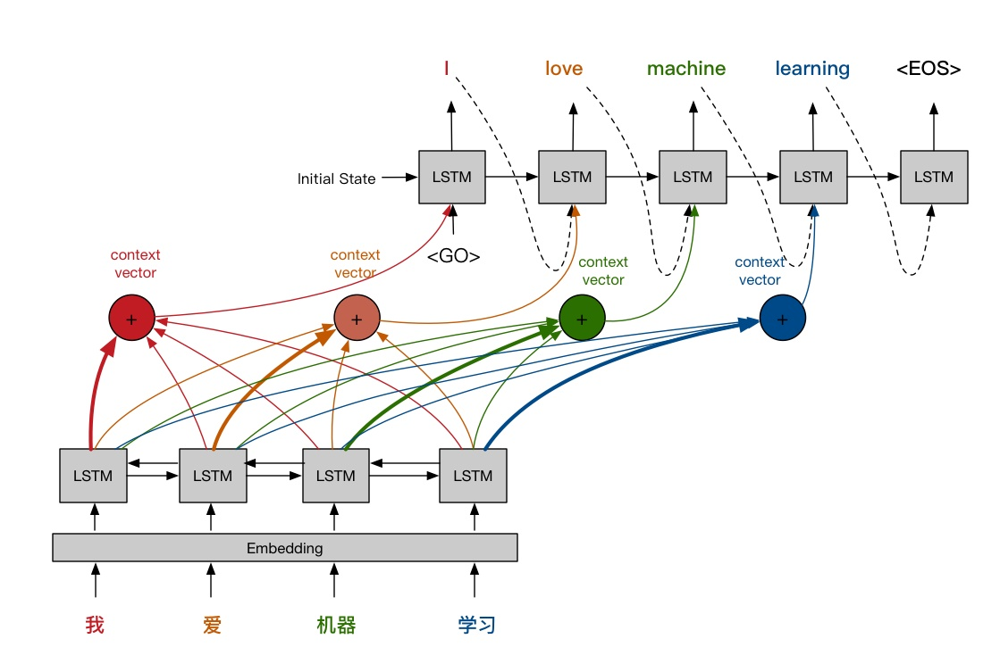

# Keras_Attention_Seq2Seq

> In order to understand the essence of things.

A sequence-to-sequence framework of Keras-based generative attention mechanisms that humans can read.

一个人类可以阅读的基于Keras的代注意力机制的序列到序列的框架/模型。



## Test pass
+ python 3.6
+ TensorFlow 1.12.1
+ keras  2.2.4
+ tqdm
+ json

if you nedd Evaluating model BLEU:
+ nltk

## Fastest Using One: English-French translation using trained models
```
python run_seq2seq_model.py
```

Remember to set the operation mode to translation mode in run_seq2seq_model.py.

```
if __name__=='__main__':

    is_translation_mode = True
```

You will see...

```
Please input your sentences: california is usually quiet during march , and it is usually hot in june .
california is usually quiet during march , and it is usually hot in june .
chine est généralement agréable en mois , et il est généralement en en . . <EOS> <PAD> <PAD> <PAD> <PAD> <PAD> <PAD> <PAD> <PAD> <PAD>
Please input your sentences: china is usually dry during march , but it is nice in november .
china is usually dry during march , but it is nice in november .
chine est parfois agréable en mois , et il est généralement en en . . <EOS> <PAD> <PAD> <PAD> <PAD> <PAD> <PAD> <PAD> <PAD> <PAD>
Please input your sentences: exit()
```

Of course, you can also train your own model.Only you need is:

```
if __name__=='__main__':

    is_load_data_and_translate_from_scrach = True
```


## Fastest Using Two: View input and output formats and use your own data
```
python attention_seq2seq_model_test.py
```

Then program automatically:
1. Generating test data and dictionaries
2. Train
3. Sequence to Sequence Conversion

**You only need to provide similar generated data and dictionaries to use the model directly**.

Of course, the raw sequence data has to be processed by yourself.

If you don't want to process the data yourself, look down.

## Framework for Sequence-to-Sequence without Coding

You may need to change the filename.

### Preparation data

1. A TXT-formatted original and target sequence file is required to be placed under the data folder.
2. Each line of the file contains a sentence, and each line of the source sequence file and the target sequence file corresponds to each other.
3. The elements of each sentence are separated by spaces, including punctuation marks.

> You can refer to the sample file under the data folder.

For example：

small_vocab_en.txt
English sentences 0 to 2:
new jersey is sometimes quiet during autumn , and it is snowy in april .
the united states is usually chilly during july , and it is usually freezing in november .
california is usually quiet during march , and it is usually hot in june .

small_vocab_fr.txt
French sentences 0 to 2:
new jersey est parfois calme pendant l' automne , et il est neigeux en avril .
les états-unis est généralement froid en juillet , et il gèle habituellement en novembre .
california est généralement calme en mars , et il est généralement chaud en juin .


### Preprocessing data files

modify data_process.py parameters: source_sequence_length, target_sequence_length...
```
python data_process.py
```
Automatically generate three files in the preparation_resources folder: 
+ the original sequence dictionary file,
+ the target sequence dictionary file
+ the serialized data file.

For example：

-----English example-----
```
the united states is never beautiful during march , and it is usually relaxing in summer .
[124, 223, 125, 189, 219, 195, 50, 158, 58, 130, 215, 189, 44, 200, 162, 178, 18, 0, 0, 0]
```

-----French example-----
```
les états-unis est jamais belle en mars , et il est relaxant habituellement en été .
[220, 209, 329, 172, 53, 46, 210, 28, 255, 225, 329, 39, 299, 46, 5, 11, 1, 0, 0, 0, 0, 0, 0, 0, 0]
```

```
DATA shape:
X_shape:	 (137861, 20)  (data_numbers, source_sequence_length)
Y_shape:	 (137861, 25)  (data_numbers, target_sequence_length)
The size of source dict is : 229
The size of target dict is : 358
```

### Traing Model

modify run_seq2seq_model.py parameters: 
+ is_translation_mode = True
+ is_load_data_and_translate_from_scrach = False
+ is_load_data_trained_Word_Vector_and_train_model = False

```
python run_seq2seq_model.py
```

For example：

is_translation_mode = True
```
Using TensorFlow backend.
正在加载训练模型参数，模型参数如下：
{'model_name': 'attention_seq2seq_model_include_Pre_trained_Word_Vector', 'train_time': 1544089042.470125, 'model_weight_file_name': 'WEIGHT_attention_seq2seq_model_include_Pre_trained_Word_Vector.h5', 'trained_Word_Vector': '/home/b418/jupyter_workspace/B418_common/袁宵/data/Glove/glove.6B.100d.txt', 'source_sequence_lenth': 20, 'target_sequence_lenth': 25, 'source_vocab_length': 229, 'target_vocab_length': 358, 'encoder_Bi_LSTM_units_numbers': 32, 'decoder_LSTM_units_numbers': 128}
The size of source dict is : 229
The size of target dict is : 358
2018-12-06 19:53:06.278300: I tensorflow/core/platform/cpu_feature_guard.cc:141] Your CPU supports instructions that this TensorFlow binary was not compiled to use: AVX2 FMA
Please input your sentences: california is usually quiet during march , and it is usually hot in june .
california is usually quiet during march , and it is usually hot in june .
chine est généralement agréable en mois , et il est généralement en en . . <EOS> <PAD> <PAD> <PAD> <PAD> <PAD> <PAD> <PAD> <PAD> <PAD>
Please input your sentences: china is usually dry during march , but it is nice in november .
china is usually dry during march , but it is nice in november .
chine est parfois agréable en mois , et il est généralement en en . . <EOS> <PAD> <PAD> <PAD> <PAD> <PAD> <PAD> <PAD> <PAD> <PAD>
Please input your sentences: exit()
```

## Evaluating model BLEU
```
python evaluating_model_BLEU.py
```

```
Using TensorFlow backend.
正在加载训练模型参数，模型参数如下：
{'model_name': 'attention_seq2seq_model_include_Pre_trained_Word_Vector', 'train_time': 1544089042.470125, 'model_weight_file_name': 'WEIGHT_attention_seq2seq_model_include_Pre_trained_Word_Vector.h5', 'trained_Word_Vector': '/home/b418/jupyter_workspace/B418_common/袁宵/data/Glove/glove.6B.100d.txt', 'source_sequence_lenth': 20, 'target_sequence_lenth': 25, 'source_vocab_length': 229, 'target_vocab_length': 358, 'encoder_Bi_LSTM_units_numbers': 32, 'decoder_LSTM_units_numbers': 128}
The size of source dict is : 229
The size of target dict is : 358
2018-12-06 19:29:26.976435: I tensorflow/core/platform/cpu_feature_guard.cc:141] Your CPU supports instructions that this TensorFlow binary was not compiled to use: AVX2 FMA
100%|███████████████████████████████████████████| 28/28 [07:46<00:00, 14.43s/it]
  0%|                                                | 0/137861 [00:00<?, ?it/s]/home/b418/anaconda3/envs/yuanxiao/lib/python3.6/site-packages/nltk/translate/bleu_score.py:490: UserWarning: 
Corpus/Sentence contains 0 counts of 2-gram overlaps.
BLEU scores might be undesirable; use SmoothingFunction().
  warnings.warn(_msg)
100%|██████████████████████████████████| 137861/137861 [05:11<00:00, 442.82it/s]
The BLEU score on our corpus is about 0.6051313546590134
```

## Explain
+ Amendments and questions are welcome.
+ My blog [望江人工智库](https://yuanxiaosc.github.io/)
+ A simplified version of notebook for this code [mt_attention_birnn](https://github.com/NELSONZHAO/zhihu/tree/master/mt_attention_birnn?1527252866900)
+ 基于Keras框架实现加入Attention与BiRNN的机器翻译模型 [mt_attention_birnn Code explanation](https://zhuanlan.zhihu.com/p/37290775)
+ An example attention network with simple dataset. https://github.com/Choco31415/Attention_Network_With_Keras

## To Do
+ change code for no need input "Manual Initialization of LSTM Initial State at Decoder"
+ add "Forced learning by teachers"
+ add "Beam search"

